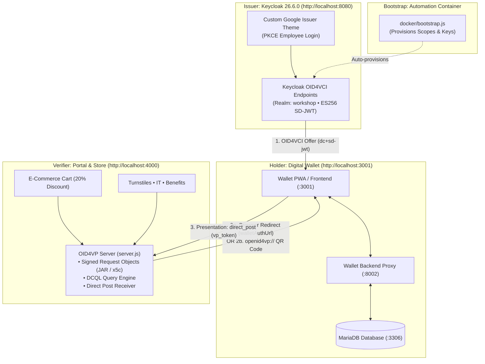

# Workshop: OpenID for Verifiable Credential Issuance (OID4VCI) & Presentation (OID4VP)

This repository provides a self-contained local digital identity workshop demonstrating:
1. **OpenID for Verifiable Credential Issuance (OID4VCI)** using **SD-JWT VC** (`dc+sd-jwt`).
2. **OpenID for Verifiable Presentations (OID4VP)** to verify credentials (e.g. Google Employee Badge) and unlock discounts and access permissions.

> [!IMPORTANT]
> **Educational and Demonstration Purpose Only**: This workshop and code repository are created strictly for educational, training, and local demonstration purposes. It is not designed or intended for real-world or production use.

---

## Architecture & Components



1. **Issuer (Keycloak 26.6.0)**:
   - URL: `http://localhost:8080` / `http://keycloak.localhost:8080`
   - Realm: `workshop`
   - Custom Welcome Theme (`docker/keycloak-theme/welcome/`): Acts as the **Google Issuer** portal. Employees log in via PKCE and click "Add to Your Wallet" to mint credential offers.
2. **Holder (wwWallet)**:
   - Frontend: `http://localhost:3001`
   - Backend Proxy: `http://localhost:8002`
   - Database: MariaDB on port `3306` (database: `wallet`, user: `wallet`, pass: `wallet`)
3. **Verifier Portal (`server.js`, `public/`, `Dockerfile`)**:
   - URL: `http://localhost:4000` / `http://verifier.localhost:4000`
   - Features:
      - **Store Cart Tab**: E-commerce cart (Pixel 9 Pro, Tech Hoodie, Running Shoes, Pixel Buds) that verifies the employee badge via OID4VP to deduct a **20% Employee Discount**.
      - **Term Plan Buy Tab**: Corporate group term life insurance purchase portal that requests **two verifiable credentials** simultaneously via DCQL:
        1. `employee_badge` (Google Employee Badge, `https://workshop.acme.test/employee-badge`)
        2. `medical_certificate` (Lilavati Hospital Medical Certificate, `https://lilavati.example/medical-certificate`)
        - Dynamically calculates term life insurance sum assured ($2,000,000 coverage for "Fit for Duty", $1,000,000 for standard), monthly subsidized premium ($25/mo with 60% corporate discount vs $65 standard), medical exam waiver certification, and policy purchase checkout.
      - **Verification Modes**:
        - **Web Wallet Flow**: Direct browser redirect to local wallet (`http://localhost:3001/?client_id=...&request_uri=...`).
        - **QR Code Flow**: Generates an `openid4vp://?client_id=x509_san_dns:verifier.localhost&request_uri=...` QR code (rendered via offline `qrcode.min.js`). The mobile wallet camera scans the QR code, submits presentation via `direct_post`, and the background poller (`/api/oid4vp/status/:sessionId`) detects verification and updates the UI dynamically.
      - **Dynamic Disclosures**:
        - Verified state displays are generated 100% dynamically from disclosed claims in the Verifiable Presentation (`given_name`, `family_name`, `department`, `employee_id`, `email`, `fitness_status`, `blood_group`, `hospital_name`, `physician_name`).
        - State is in-memory per session; page refresh resets the cart and term plan for clean testing.
      - **OID4VP Implementation**:
        - Issues signed request objects (`typ: "oauth-authz-req+jwt"`, `x509_san_dns:verifier.localhost`) supporting multi-credential DCQL queries.
        - **Cryptographic Verification Engine**: Verifies Issuer JWT signatures using Keycloak's remote JWKS (`ES256`), validates `iss` whitelist and `vct`, recomputes SHA-256 digests of all presented disclosures against `_sd` hashes, verifies holder Key-Binding JWT (`kb+jwt`) against `cnf.jwk` (validating session `nonce`, `aud`, and `sd_hash`), and enforces single-use session replay protection.
        - Rejects forged signatures, untrusted issuers, tampered disclosures, and session replays with HTTP 400 and surfaces clear error states in both API responses and the UI.
4. **Bootstrap Runner (`docker/bootstrap.js`)**:
   - Runs on compose startup to ensure Keycloak client scopes (`employee-badge`, `employee-badge-jwt`, `medical-certificate`) are registered, configures the Declarative User Profile, and assigns scopes and attributes to demo users.

---

## Demo Accounts & Configuration

- **Keycloak Admin**:
  - URL: `http://localhost:8080/admin/`
  - Username: `admin` / Password: `admin`
- **Demo Employees**:
  - `ronak` (Ronak Patel, Platform Engineering) &mdash; Password: `workshop`
  - `raj` (Raj Sharma, Security) &mdash; Password: `workshop`
  - `milan` (Milan Mehta, Finance) &mdash; Password: `workshop`
  - Pre-configured claims: `employee_id`, `department`, `age_over_18`, `picture`, `given_name`, `family_name`, `email`

---

## Verifiable Credentials & Scopes

- **Primary Credential**: `employee-badge`
  - Format: `dc+sd-jwt` (SD-JWT VC)
  - VCT: `https://workshop.acme.test/employee-badge`
  - Alg: `ES256` (signed with demo EC key via Keycloak)
  - Display Name: `Google Employee Badge`
- **Fallback Credential**: `employee-badge-jwt`
  - Format: `jwt_vc_json` (W3C VC-JWT)
- **Claims**:
  - `given_name`, `family_name`, `email`, `employee_id`, `department`, `age_over_18`, `picture`
- **Display Artwork**:
  - Google Brand Logo: `https://upload.wikimedia.org/wikipedia/commons/2/2f/Google_2015_logo.svg`
  - Card Background: `https://images.unsplash.com/photo-1618005182384-a83a8bd57fbe?w=829&h=504&fit=crop&q=80`

---

## Common Commands

```bash
# Start all services (Issuer, Holder, Verifier)
docker compose -f docker/docker-compose.yml up -d

# Check status of containers
docker compose -f docker/docker-compose.yml ps

# View logs
docker compose -f docker/docker-compose.yml logs -f verifier
docker compose -f docker/docker-compose.yml logs -f keycloak
docker compose -f docker/docker-compose.yml logs -f wallet-backend

# Stop services
docker compose -f docker/docker-compose.yml down

# Run end-to-end cryptographic verification test suite
npm test

# Reset state completely (re-imports realm on next up)
docker compose -f docker/docker-compose.yml down -v
```
