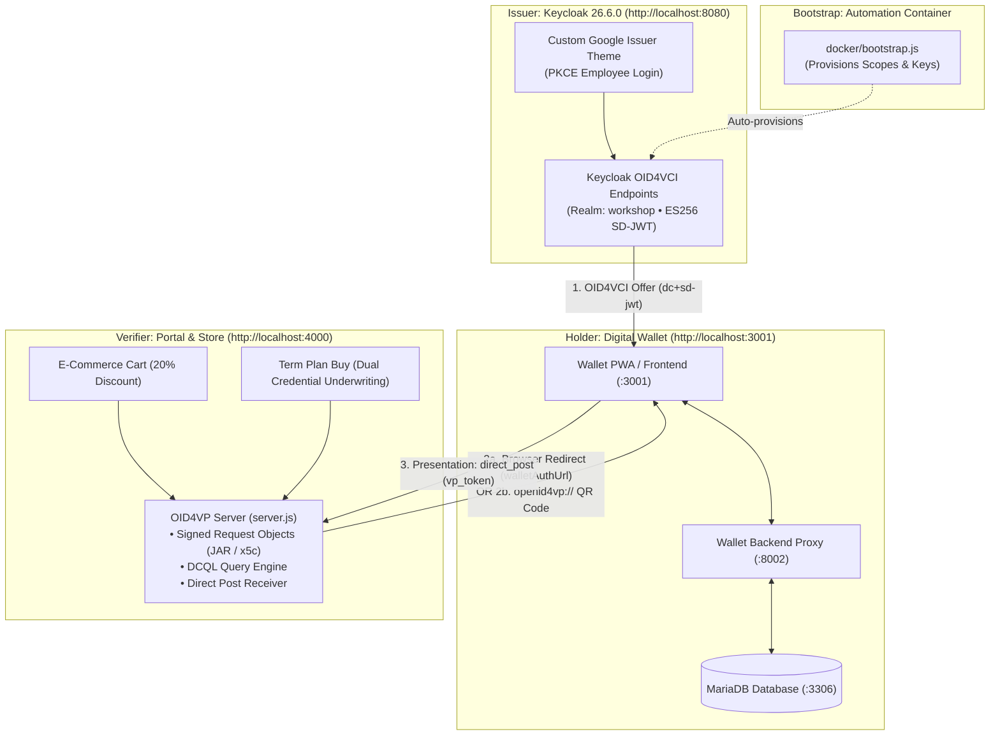

# Digital Identity Workshop: OID4VCI & OID4VP with SD-JWT VC

A complete, self-contained local digital identity workshop demonstrating end-to-end credential issuance and presentation using modern open standards:
- **OpenID for Verifiable Credential Issuance (OID4VCI)**
- **OpenID for Verifiable Presentations (OID4VP)**
- **IETF SD-JWT-based Verifiable Credentials (`dc+sd-jwt`)** with Selective Disclosure

> [!IMPORTANT]
> **Educational and Demonstration Purpose Only**: This workshop and code repository are created strictly for educational, training, and local demonstration purposes. It is not designed or intended for real-world or production use.

---

## Purpose & Overview

This workshop demonstrates how modern enterprise and consumer applications can replace static passwords, badge cards, and fragile OAuth integrations with **cryptographic, user-held Verifiable Credentials**.

### Key Objectives:
1. **Decentralized Employee Identity**: Issue a tamper-proof **Google Employee Badge** using Keycloak acting as an OID4VCI credential issuer.
2. **User-Controlled Holder Wallet**: Store and manage credentials securely in an OpenID-compliant digital wallet.
3. **Selective Disclosure**: Reveal only minimal required attributes (e.g. `department` and `employee_id`) rather than over-sharing personal data.
4. **Frictionless Real-World Verification (OID4VP)**:
   - **E-Commerce Store Cart**: Present the badge to automatically deduct an instant **20% Employee Discount**.
   - **Two Verification Flows**:
     - **Web Wallet Flow**: Direct in-browser redirect to the local wallet.
     - **QR Code Flow**: Scan with a mobile camera scanner for cross-device verification.
   - **Enterprise Scenarios**: Turnstile building access, IT privileged access, and corporate perks.

---

## Architecture & Component Flow



### Components:
| Service | URL | Role | Description |
| :--- | :--- | :--- | :--- |
| **Issuer** | `http://localhost:8080/` | Keycloak 26.6 | Issues SD-JWT Employee Badges and Lilavati Hospital Medical Certificates over OID4VCI. |
| **Holder** | `http://localhost:3001/` | Digital Wallet | Open-source holder web app storing credentials and executing presentations. |
| **Verifier** | `http://localhost:4000/` | Verification Portal | Verifies credentials via OID4VP for Store Cart discounts and Term Plan insurance underwriting. |
| **Bootstrap** | *Background container* | Automation Runner | Provisions Keycloak client scopes, user profile policies, and user credential entitlements. |

---

## Quick Start

Start all services using Docker Compose:

```bash
cp -n docker/.env.example docker/.env
docker compose -f docker/docker-compose.yml up -d
```

Wait about 20-30 seconds for Keycloak to report `(healthy)`. For advanced configuration, live-reload local development, and troubleshooting, see the **[Developer Guide](DEVELOPER.md)**.

---

## Demo Accounts

Pre-configured corporate employee accounts in the `workshop` realm:

| Username | Password | Full Name | Department | Employee ID | Role / Notes |
| :--- | :--- | :--- | :--- | :--- | :--- |
| **`ronak`** | `workshop` | Ronak Patel | Platform Engineering | `ACME-0417` | Primary demo employee |
| **`raj`** | `workshop` | Raj Sharma | Security | `ACME-1182` | Security team demo |
| **`milan`** | `workshop` | Milan Mehta | Finance | `ACME-2043` | Finance team demo |
| **`admin`** | `admin` | Keycloak Admin | &mdash; | &mdash; | Realm administrator |

---

## Step-by-Step Demo Walkthrough

### Step 1: Collect Your Google Employee Badge (Issuance)
1. Open the Google Issuer portal: **[http://localhost:8080/](http://localhost:8080/)**
2. Click **Sign in to collect my badge**.
3. Log in using `ronak` (password: `workshop`).
4. Keycloak mints an OID4VCI Credential Offer.
5. Click **Open in my wallet →**.
6. The wallet opens at `http://localhost:3001/`, parses the credential offer, requests the credential from Keycloak, and stores your **Google Employee Badge**.

---

### Step 2: Use Your Badge to Get 20% Off (Presentation)
1. Navigate to the Store Cart portal: **[http://localhost:4000/](http://localhost:4000/)**
2. Notice the cart has Google merchandise (Pixel 9 Pro, Tech Hoodie, etc.) with standard pricing and tax.
3. In the right sidebar under **Google Employee Discount**, choose your preferred verification mode:

#### Option A: Apply with Web Wallet (Desktop Browser Flow)
- Click **Apply with Web Wallet**.
- You are redirected to your local wallet at `http://localhost:3001/`.
- Review the requested attributes (`employee_id`, `department`, `given_name`, `family_name`, `email`).
- Click **Share / Disclose**.
- The wallet submits the presentation directly to the verifier and redirects back to the cart.

#### Option B: Scan QR with Mobile (Cross-Device Flow)
- Click **Scan QR with Mobile**.
- A QR code appears with a live status indicator (*"Waiting for wallet presentation..."*).
- Open your digital wallet's camera scanner on your mobile view and scan the QR code.
- Confirm the presentation on the wallet.
- The cart's background poller detects verification in real time, automatically dismisses the modal, and unlocks the discount!

---

### Step 3: Verified State & Dynamic Disclosures
- The cart automatically updates:
  - An instant **20% Employee Discount** is deducted from the total.
  - A green badge card displays the verified employee information:
    - **Holder Name**: Rendered dynamically from `given_name` + `family_name` (e.g. *Ronak Patel*).
    - **Department & ID**: Extracted dynamically from disclosures (e.g. *Platform Engineering • ID: ACME-0417*).
- Click **Proceed to Checkout** to see the final receipt with validated discount breakdown.

> [!NOTE]
> **Zero-Persistence Session**: Reloading the cart page (`Cmd + R` / `F5`) immediately clears the verification state so you can repeatedly test the issuance and verification flows without manual database cleanup.

---

### Step 4: Corporate Term Life Insurance Underwriting (Dual-Credential Presentation)
1. Switch to the **Term Plan Buy** tab in the top navigation bar of **[http://localhost:4000/](http://localhost:4000/)**.
2. Notice the instant underwriting portal requiring two credentials via DCQL:
   - **Employee Badge** (`https://workshop.acme.test/employee-badge`)
   - **Medical Certificate** (`https://lilavati.example/medical-certificate`)
3. Click **Present with Web Wallet** (or scan the QR code with your mobile wallet).
4. Disclose your identity and Lilavati Hospital clinical fitness status.
5. The verifier cryptographically validates both credentials, assesses the clinical health rating, calculates coverage ($2,000,000 Platinum Preferred for *Fit for Duty* with 60% corporate subsidy at $25/mo), and certifies the medical exam waiver.
6. Click **Buy Term Plan** to instantly bind the corporate term life policy.

---

## Next Steps & Developer Guide

For local live-reload development, container management commands, and troubleshooting, see the **[Developer Guide](DEVELOPER.md)**. For digital identity and verifiable credentials terminology, see the **[Glossary](GLOSSARY.md)**.
